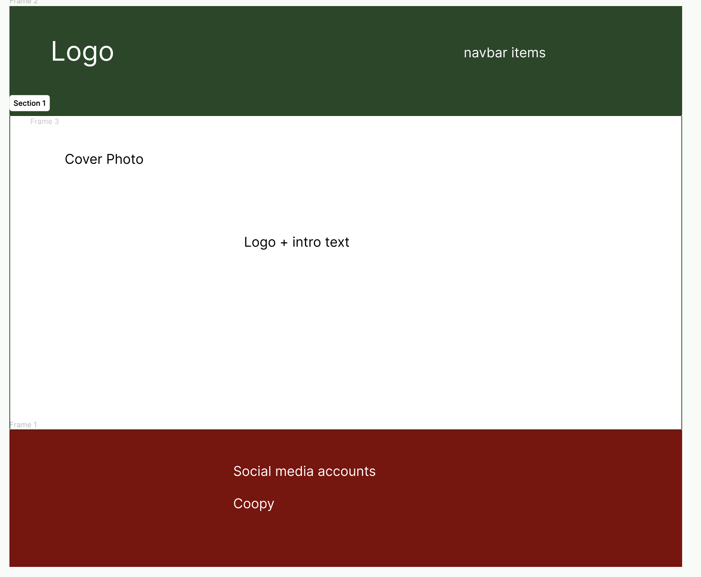
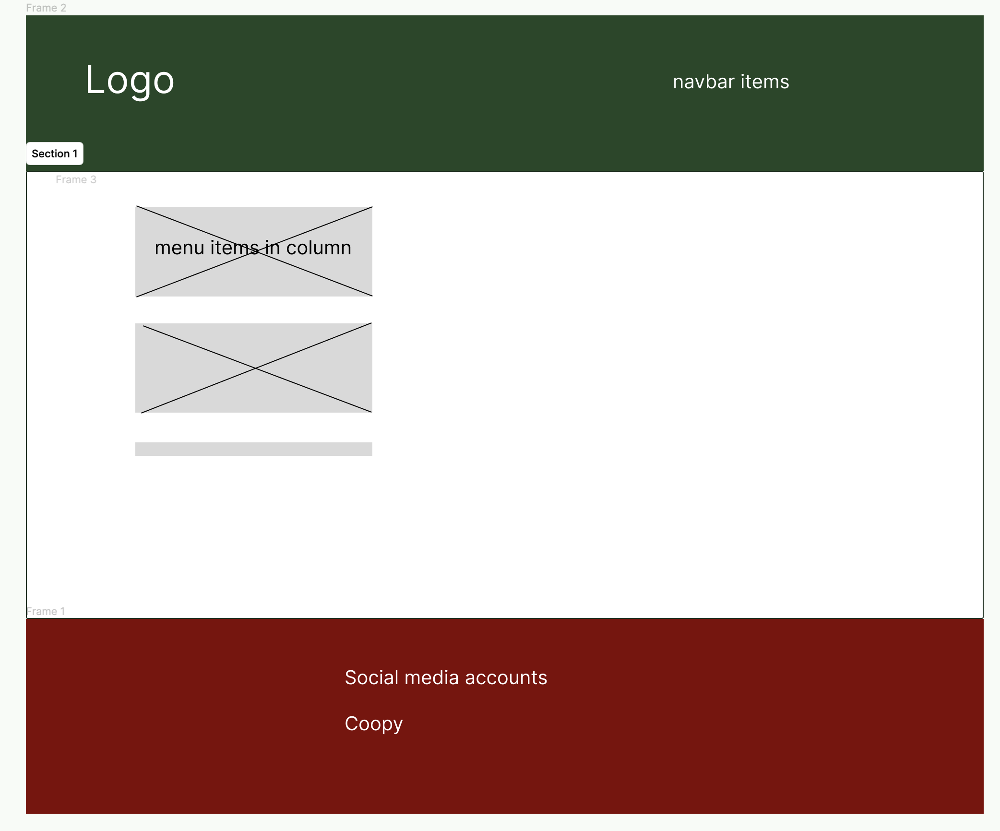
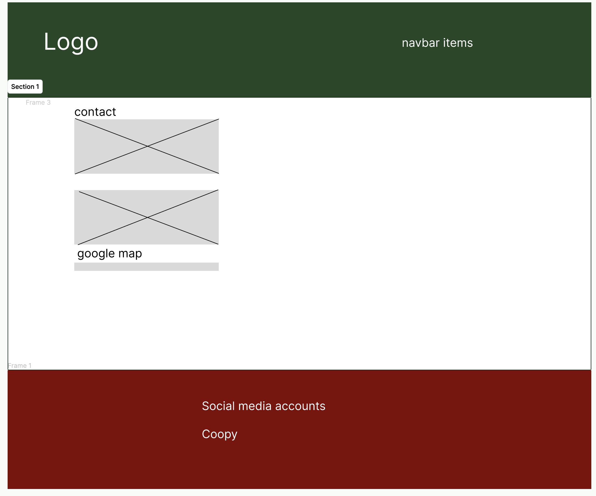
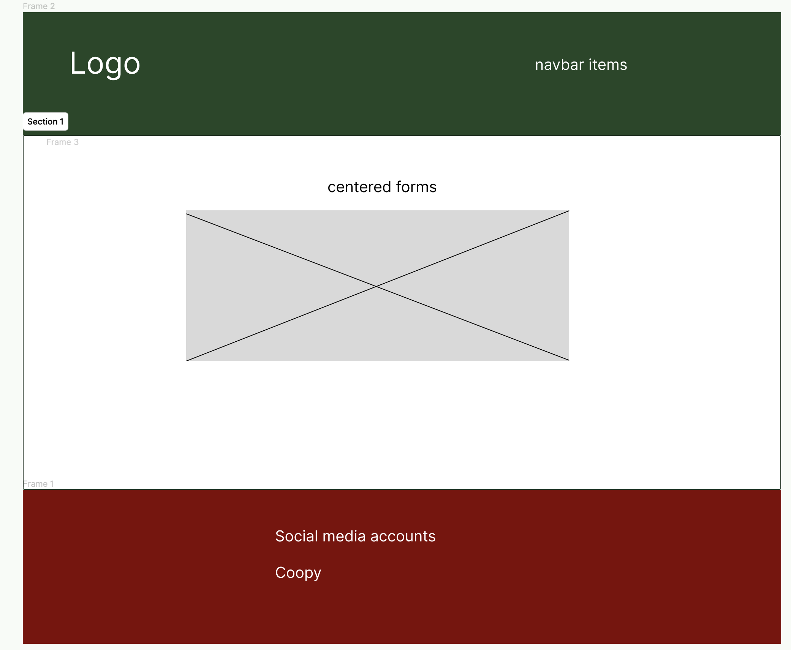

# Pasta Italiano

- A website for all the pasta lovers who wants to book a table at an amazing pasta resturant in Stockholm. Here the user/costumer can easily navigate troght the site and book a table in different sizes. The user can also edit or delete their reservation easily.

---

## CONTENTS

* [User Experience](#user-experience-ux)
  * [User Stories](#user-stories)
  * [Client Goals](#client-goals)
  * [First Time Visitor Goals](#first-time-visitor-goals)
  * [Returning Visitor Goals](#returning-visitor-goals)

* [Design](#design)
  * [Colour Scheme](#colour-scheme)
  * [Typography](#typography)
  * [Imagery](#imagery)
  * [Wireframes](#wireframes)

* [Features](#features)
  * [Future Implementations](#future-implementations)
  * [Accessibility](#accessibility)

* [Technologies Used](#technologies-used)
  * [Languages Used](#languages-used)
  * [Frameworks, Libraries & Programs Used](#frameworks-libraries--programs-used)

* [Deployment](#deployment)
  * [Deployment](#deployment)

* [Testing](#testing)

* [Credits](#credits)
  * [Code Used](#code-used)
  * [Content](#content)
  * [Media](#media)
  * [Acknowledgments](#acknowledgments)

---

## User Experience (UX)

### User Stories

- As a Site User I can  View the menu and see the prices so that I can decide if it's something for me

- As a Site User I can Log in and see availibly booking options and be able to specify the numer of guests so that I can book a time that fits me and my company

- As a Site User I can Create an Account so that I can handle my bookings and make bookings

- As a SIte User/Owner I can Delete reservations so that if there is a need of cancellation it can be done easily

- As a Site User/Owner I can Update reservations so that I can make changes

- As a Site owner I can see a list of my costumers reservations so that I have an overview about my resturant

- As a Site owner I can have a admin dashboard so that I can manually manage reservations

### Client Goals

* To be able to view the reservation system both from phones and bigger screens.
* To make it easy for costumers to book and edit/delete a table in the resturant.
* To make it easy for the costumers to find contact info and location info.
* To make it easy for the costumers to see the menu.

### First Time Visitor Goals

* Want to book a table.
* Want to find out opening hours and location.
* Want to look at the menu.

### Returning Visitor Goals

* Want to be able to edit/delete my reservation.
* Want to view/search for my reservation.
* Be able to sign in/out.

## Design

### Colour Scheme

- The colors of the site is white #fff, and a dark green rgb(27, 71, 27), also a red color #ce2a2a. The colors have been used troghout the whole site and are inpiered by the Italian flag

### Typography

- The fonts used in the site is: Lobster two. The font is used in headings and the logo. In the paraghraph there is the default font from bootstraps styling. 

[Google Fonts](https://fonts.google.com/specimen/Lobster+Two?query=lob)

### Imagery

- The site has 6 photos taken from [pixabay](https://pixabay.com/sv/images/search/) which was free, and two photos bought from [istock](https://www.istockphoto.com/se)

### Wireframes

- Ive made some easy and simple wireframes with figma, the wireframe for centered forms are for all forms that the site handels and are general.

## Features

 * Home page: The home page has an cover photo on pasta, a short intro text and a logo and a button that takes the user to the reservation page if the user is loged in, otherwise the user will be requiered to log in or register first. On top of every page is a nav bar wcich is easy to use.

 * Menu page: The menu page has cards in columns with pictures and a short explanation of the dishes the costumer can choose from. As a background there is a red/white tablecloth. 

 * Contact page: The contact page is very simple and easy to read, there is one section with the phone number, one with the email and one with the location that has an google map. 

 * Login page: The log in page is a simple form.

 * Register page: A simple fill out form, with simple colors and a button.

 * Make a reservation page: A page where the user can choose the size of the table.

 * Search page: A simple page where the user can search for reservations.

 * My reservations page: A page where the user can view their reservations and if there is a reservation they can also click the buttun edit/delete that redirect the user to the edit page.

 * Edit/Delete page: A page very simple where the user has the ability to edit the time/date of the reservation or delete the booking.

 * Logout page: When the user wants to log out the page will ask if the user is shure otherwise the user will be logged out. all of the pages with forms are simple and easy. With the withe background and the green navbar and a red footer.

 * Navbar: The navbar is in dark green with white text and easy understandibly nav links, when the screen becomes smaller the menu becomes a hamburger menu. 

 * Footer: The footer is in red with white text and contains links to social media accounts. 

### Future Implementations

I've would like to add nicer UI, or maybe some extra pages.

### Accessibility

The site is accesibly to all screens and in smaller screens the navbar becomes an hamburger menu. The fonts are easy to read and ive included icons to easily see what the textes will provide. The colors are darker and the fonts and text withe, thats makes it easy for the readers to see and read.

## Technologies Used

### Languages Used

Html, CSS , Javascript and Python+Django. SQL for databases.

### Frameworks, Libraries & Programs Used

1. [Django:](https://www.djangoproject.com/)
    - Django Framework is a full stack framework based on python.
1. [Bootstrap 5.1.3:](https://startbootstrap.com/theme/business-casual)
    - Bootstrap is a css framework that uses classes to style.
1. [Google Fonts:](https://fonts.google.com/)
    - Google fonts to set the fonts of the site.
1. [Font Awesome:](https://fontawesome.com/)
    - Font Awesome is a site to get icons from and theres where i got my icons from.
1. [jQuery:](https://jquery.com/)
    - jQuery is a type of javascript, it makes the code smaller in amount.
1. [Git:](https://git-scm.com/)
    - Git was used for version control.
1. [GitHub:](https://github.com/)
    - GitHub is where my repositry is found.
1. [Figma:](https://www.figma.com/templates/wireframe-kits/)
    - Designing program where i made my wireframes.  
1. [ElephantSQL:](https://www.elephantsql.com/)
    - Elephant Sql database.
1. [Cloudinary:](https://cloudinary.com/)
    - Media files handler and cloud.
1. [Heroku:](https://www.heroku.com/)
    -  Heroku is where i deployed my app.

## Deployment 

Final deployed work [here](https://pastaitaliano-4a14a7e65e7b.herokuapp.com/). Deployed on heroku [heroku](https://id.heroku.com/login). 

Steps of deployment:

1. Create a github repositry, To create a GitHub repository, I navigated to GitHub, logged in, and clicked on the "+" sign in the upper right corner. Then, I selected "New Repository" and followed the steps to create the repository, including naming it, adding a description, and configuring repository settings.
2. Create user stories in github.
3. In the Gitpod environment, I created a Django project with the necessary files and an app.
4. I set up a Heroku app on the Heroku platform by navigating to the Heroku Dashboard and clicking on "New" > "Create new app". I provided a unique name for my app and created it.
5. Creating a database at elephantSQL. 
6. Create a env.py file in your environment and add it to .gitignore. In the env file add 'import os and add in os.environ["DATABASE_URL"]="here you put your database url from elephant sql", also add the database url in heroku under config vars.
7. Generete a secret key and add it in the env.py file 'os.environ["SECRET_KEY"]="secret key here"', also add it in heroku under config vars.
8. In settings.py, I imported os and set up a conditional statement to use environment variables from env.py outside the development environment, including the secret key.
9. I commented out the existing code for databases in settings.py and added code to utilize the Django database URL specified in env.py and Heroku config vars.
11. I applied these changes in Gitpod using `python3 manage.py migrate`.
12. Add in another config var to heroku port 8000.
13. To handle static and media files on Cloudinary, I obtained the API Environment Variable from my Cloudinary account dashboard.
14. I included this variable in env.py and Heroku Settings > config vars.
15. Additionally, I added `DISABLE_COLLECTSTATIC = 1` to the Heroku config vars.
16. In settings.py, I added `cloudinary` and `cloudinary_storage` to the list of installed apps.
17. I configured the static file storage, static file directory, static root, media URL, default file storage, and templates directory in settings.py.
18. I appended my Heroku app name followed by `herokuapp.com` to the `ALLOWED_HOSTS` variable in settings.py, along with 'localhost' for the development environment.
19. At the project's top level, I created three directories: media, static, and templates.
20. I added a Procfile to the top-level directory.
21. After performing a `git add`, `git commit`, and `git push`, I moved to the Deployment tab in Heroku, enabled Automated Deployment, connected my GitHub repository, and deployed the branch.
22. Upon opening the deployed app, I was greeted with a success message and a rocket icon.
23. For the final deployment step, I set Debug to False in settings.py in Gitpod.
24. In Heroku, I removed the `DISABLE_COLLECTSTATIC` variable.
25. I saved all changes and performed a `git add`, `git commit`, and `git push".

## Testing

TESTING.md file [here](testing.md)

## Credits

For the Readme structure i give credits to [here](https://github.com/kera-cudmore/BookWorm#Credits), thats where I looked on the structure of the Readme file.
I also took inpiretion from [renatasresturant](https://github.com/renatalantos/booking-system/blob/main/README.md#technologies-used), and code institutes walktrough blog [codeinstitute](https://github.com/Code-Institute-Solutions/Django3blog/blob/master/12_final_deployment/templates/base.html). 

### Code Used

I took inpiretion from [renatasresturant](https://github.com/renatalantos/booking-system), and code institutes walktrough blog [codeinstitue](https://github.com/Code-Institute-Solutions/Django3blog/blob/master/12_final_deployment/templates/base.html). Some parts of the code is taken from these two links.

### Content

I made the content on the site by myself.

  
###  Acknowledgments

I like to thank my mentor Jubril and all of the tutors in the code institute team for helping me out during the project. 