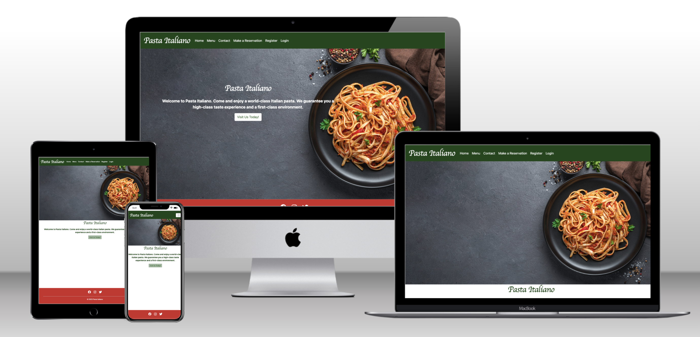

# Pasta Italiano

- A website for all the pasta lovers who wants to book a table at an amazing pasta resturant in Stockholm. Here the user/costumer can easily navigate troght the site and book a table in different sizes. The user can also edit or delete their reservation easily.

---

## CONTENTS

* [User Experience](#user-experience-ux)
  * [User Stories](#user-stories)
  * [Client Goals](#client-goals)
  * [First Time Visitor Goals](#first-time-visitor-goals)
  * [Returning Visitor Goals](#returning-visitor-goals)

* [Design](#design)
  * [Colour Scheme](#colour-scheme)
  * [Typography](#typography)
  * [Imagery](#imagery)
  * [Wireframes](#wireframes)

* [Features](#features)
  * [Future Implementations](#future-implementations)
  * [Accessibility](#accessibility)

* [Technologies Used](#technologies-used)
  * [Languages Used](#languages-used)
  * [Frameworks, Libraries & Programs Used](#frameworks-libraries--programs-used)

* [Deployment & Local Development](#deployment--local-development)
  * [Deployment](#deployment)
  * [Local Development](#local-development)
    * [How to Fork](#how-to-fork)
    * [How to Clone](#how-to-clone)

* [Testing](#testing)

* [Credits](#credits)
  * [Code Used](#code-used)
  * [Content](#content)
  * [Media](#media)
  * [Acknowledgments](#acknowledgments)

---

## User Experience (UX)

### User Stories

### Client Goals

* To be able to view the reservation system both from phones and bigger screens.
* To make it easy for costumers to book and edit/delete a table in the resturant.
* To make it easy for the costumers to find contact info and location info.
* To make it easy for the costumers to see the menu.

### Client Goals

* To be able to view the reservation system both from phones and bigger screens.
* To make it easy for costumers to book and edit/delete a table in the resturant.
* To make it easy for the costumers to find contact info and location info.
* To make it easy for the costumers to see the menu.

### First Time Visitor Goals

* Want to book a table.
* Want to find out opening hours and location.
* Want to look at the menu.

### Returning Visitor Goals

* Want to be able to edit/delete my reservation.
* Want to view/search for my reservation.
* Be able to sign in/out.

## Design

### Colour Scheme

- The colors of the site is white #fff, and a dark green rgb(27, 71, 27), also a red color #ce2a2a. The colors have been used troghout the whole site and are inpiered by the Italian flag

### Typography

- The fonts used in the site is: Lobster two. The font is used in headings and the logo. In the paraghraph there is the default font from bootstraps styling. 

[Google Fonts](https://fonts.google.com/specimen/Lobster+Two?query=lob)

### Imagery

- The site has 6 photos taken from [pixabay](https://pixabay.com/sv/images/search/) which was free, and two photos bought from [istock](https://www.istockphoto.com/se)

## Features

 * Home page: The home page has an cover photo on pasta, a short intro text and a logo and a button that takes the user to the reservation page if the user is loged in, otherwise the user will be requiered to log in or register first. On top of every page is a nav bar wcich is easy to use.

 * Menu page: The menu page has cards in columns with pictures and a short explanation of the dishes the costumer can choose from. As a background there is a red/white tablecloth. 

 * Contact page: The contact page is very simple and easy to read, there is one section with the phone number, one with the email and one with the location that has an google map. 

 * Login page: The log in page is a simple form.

 * Register page: A simple fill out form, with simple colors and a button.

 * Make a reservation page: A page where the user can choose the size of the table.

 * Search page: A simple page where the user can search for reservations.

 * My reservations page: A page where the user can view their reservations and if there is a reservation they can also click the buttun edit/delete that redirect the user to the edit page.

 * Edit/Delete page: A page very simple where the user has the ability to edit the time/date of the reservation or delete the booking.

 * Logout page: When the user wants to log out the page will ask if the user is shure otherwise the user will be logged out. all of the pages with forms are simple and easy. With the withe background and the green navbar and a red footer.

 * Navbar: The navbar is in dark green with white text and easy understandibly nav links, when the screen becomes smaller the menu becomes a hamburger menu. 

 * Footer: The footer is in red with white text and contains links to social media accounts. 

### Future Implementations

I've would like to add nicer UI, or maybe some extra pages.

### Accessibility

The site is accesibly to all screens and in smaller screens the navbar becomes an hamburger menu. The fonts are easy to read and ive included icons to easily see what the textes will provide. The colors are darker and the fonts and text withe, thats makes it easy for the readers to see and read.

## Technologies Used

### Languages Used

Html, CSS , Javascript and Python+Django. SQL for databases.

### Frameworks, Libraries & Programs Used

Add any frameworks, libraries or programs used while creating your project.

Make sure to include things like git, GitHub, the program used to make your wireframes, any programs used to compress your images, did you use a CSS framework like Bootstrap? If so add it here (add the version used).

A great tip for this section is to include them as you use them, that way you won't forget what you ended up using when you get to the end of your project.

## Deployment & Local Development

👩🏻‍💻 View an example of a completed Deployment & Local Development section [here](https://github.com/kera-cudmore/TheQuizArms#Deployment)

### Deployment

Include instructions here on how to deploy your project. For your first project you will most likely be using GitHub Pages.

### Local Development

The local development section gives instructions on how someone else could make a copy of your project to play with on their local machine. This section will get more complex in the later projects, and can be a great reference to yourself if you forget how to do this.

#### How to Fork

Place instructions on how to fork your project here.

#### How to Clone

Place instructions on how to clone your project here.

## Testing

TESTING.md file [here](testing.md)

## Credits

For the Readme structure i give credits to [here](https://github.com/kera-cudmore/BookWorm#Credits), thats where I looked on the structure of the Readme file.
I also took inpiretion from , and code institutes walktrough blog . 

### Code Used

I took inpiretion from , and code institutes walktrough blog .

### Content

I made the content on the site by myself.

  
###  Acknowledgments

I like to thank my mentor Jubril and all of the tutors in the code institute team for helping me out during the project. 