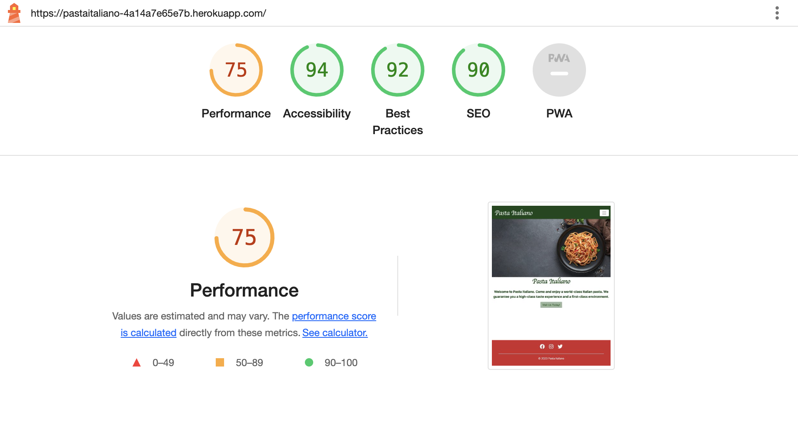
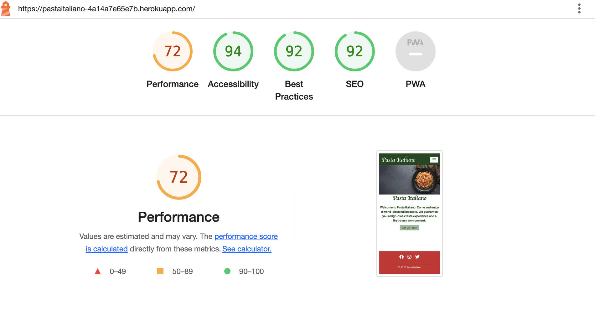

# Testing

- For this project im worked with manual testing just.

- Testing in [WC3html](https://validator.w3.org/nu/#textarea) for the html only showed errors of the python code, the other code passed.

- Testing in[WC3css](https://jigsaw.w3.org/css-validator/validator) for the css code had no errors, all was good. 

- Testing in [JShint](https://jshint.com/) for javascript errors i got two warnings that the let keyword is avalibly in es6, and then i got errors abot bootstrap and google words whitin my functions that it did not recognize. Also i got one warning that my marker variable is not used in my google map init function, but i checked and the marker works fine. I got one that i forgot a semicolon and i added one in there. 

- Testing in [PEP8ci](http://pep8ci.herokuapp.com/#) for python code , the tests went trough  I only had some warnings about to long lines and whitespaces.

- Testing in [lighthouse](https://pastaitaliano-4a14a7e65e7b.herokuapp.com/) on devtools i got very high rates att assecibility both on phones and desktops. 

